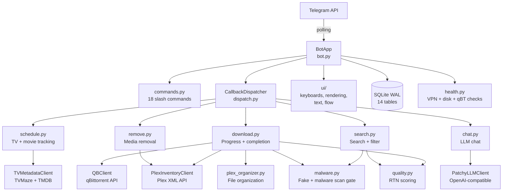

---
tags:
  - home
aliases:
  - Patchy Dashboard
created: 2026-04-11
updated: 2026-04-13
---

# Dashboard

## Overview

Welcome to the Patchy Bot vault. Patchy is a Telegram-based assistant that searches for movies and TV shows, hands them off to qBittorrent for downloading, scans the results for malware, and organizes the finished files into a Plex media library.

This dashboard is your starting point — it shows what work is open right now, what was finished recently, and how all the pieces of the system fit together.

## Current Focus

**Skill infrastructure landed (2026-04-13, late).** 14-skill Python suite is now installed at `.claude/skills/`, Context7 moved from the MCP plugin to the `ctx7` CLI (CLI + Skills mode), and `context7-skills-scout` + `find-docs` are available globally. Immediately prior: Malware Engine v2 Session 5 — see [[Malware Engine v2]]; future idea parked at [[telegram-malware-config]].

## Recent Completions

- **2026-04-13 (late)** — Python skill suite (14 skills) installed, Context7 CLI migration, download.py closure cleanup.
- **2026-04-13** — Malware Engine v2 Session 5 (per-user attribution, `/malware_stats`, `SignalID` constants, weekly digest, ClamAV docs, vault architecture page).
- **2026-04-11** — Obsidian vault rewritten into the `00-Home/` … `05-Changelog/` layout.
- **2026-04-10** — Episode filtering fix, next-ep callback fix, inspection timeout bump, candidate cycling fix.
- **2026-04-08** — Movie release scheduling system (`msch:` callbacks, `movie_tracks` table).
- **2026-04-07** — Batch of 17 fixes across qBT, poller, organizer, malware gate, and schedule UI.

## Open Work

```dataview
TABLE priority, status, file.folder AS "Bucket"
FROM #work/todo OR #work/upgrade
WHERE status != "done"
SORT priority ASC
```

## Recent Changelog

```dataview
TABLE created
FROM #changelog
SORT created DESC
LIMIT 5
```

## System Map



## Quick Links

- [[System Overview]]
- [[Work Board]]
- [[Preferences]]
- [[Ideas Index]]
- [[Changelog Index]]
- [[Vault Guide]]
- [[SETUP]]

> [!code]- Claude Code Reference
> **Runner timing**
> - Schedule runner: 60s tick
> - Remove runner: 60s tick
> - Completion poller: 60s tick
> - Command center refresh: 3s tick
>
> **Service dependency summary**
> - `telegram-qbt-bot.service` (systemd) → polls Telegram, depends on local `qbittorrent-nox.service` and Plex (`plexmediaserver.service`) being reachable on the LAN. Surfshark WireGuard policy routing handles VPN enforcement at the OS level — qBT must NOT be interface-bound.
>
> **Tech stack**
> - Python 3.12+
> - python-telegram-bot (long polling, not webhook)
> - SQLite WAL mode, `busy_timeout=5000`
> - `asyncio` event loop with background runner tasks
> - systemd unit for process supervision
>
> **Current line counts**
> - `bot.py`: 5023 lines (Phase 2 decomposition target: under 2000)
