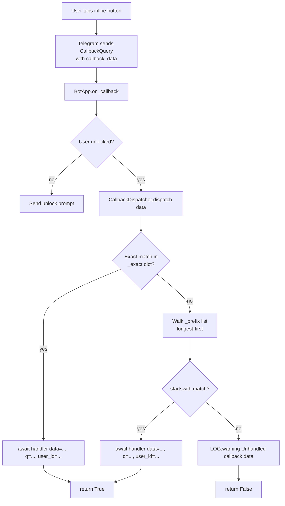

---
tags:
  - system/callbacks
aliases:
  - Callback Dispatcher
created: 2026-04-11
updated: 2026-04-11
---

# Callback Routes

## Overview

When you tap an inline button in a Telegram chat, Telegram does **not** send the button's label back to the bot. Instead, the button has a hidden short string attached to it called **callback data**, and Telegram sends just that string. The bot then has to look up "what does this string mean?" and run the right code.

Patchy uses a phone-directory-style lookup to do this. The directory is called the `CallbackDispatcher` and lives in `dispatch.py`. It works in two ways:

- **Exact entries** — like a phone book listing for one specific name. If the callback data is *exactly* `nav:home`, run this function.
- **Prefix entries** — like an area-code rule. If the callback data *starts with* `sch:`, run the schedule handler. The schedule handler then reads the rest of the string to figure out which sub-action.

When a button tap arrives, the dispatcher first checks the exact list (one fast dictionary lookup). If nothing matches, it walks the prefix list and picks the first one whose prefix matches the start of the data. Importantly, the prefix list is kept sorted **longest first**, so that a more specific prefix like `stop:all:` is tried before the more general `stop:`. Without that ordering, the general one would always win and the specific handler would never run.

The format Patchy uses for callback data is colon-delimited segments: `prefix:param1:param2`. For example, `sch:track:42` is "schedule namespace, track sub-action, track id 42." This keeps the strings short (Telegram caps callback data at 64 bytes) and easy to parse.

There are **15 registrations** wired up at startup in `BotApp._build_callback_dispatcher()` (`bot.py:161-175`): **2 exact** matches and **13 prefix** matches. (The phase-B plan estimated 14; the actual count is 15. The extra one is the longest-first split between `stop:all:` and `stop:`, which together with `tvpost:` and `moviepost:` brings the total to 15.) See the table below for the full registry.

> [!code]- Claude Code Reference
>
> ### Dispatcher (`telegram-qbt/patchy_bot/dispatch.py`)
>
> ```python
> class CallbackDispatcher:
>     def __init__(self) -> None:
>         self._exact: dict[str, Handler] = {}
>         self._prefix: list[tuple[str, Handler]] = []
>
>     def register_exact(self, data: str, handler: Handler) -> None:
>         self._exact[data] = handler
>
>     def register_prefix(self, prefix: str, handler: Handler) -> None:
>         self._prefix.append((prefix, handler))
>         self._prefix.sort(key=lambda x: len(x[0]), reverse=True)
>
>     async def dispatch(self, data: str, **kwargs: Any) -> bool:
>         handler = self._exact.get(data)
>         if handler is not None:
>             await handler(data=data, **kwargs)
>             return True
>         for prefix, handler in self._prefix:
>             if data.startswith(prefix):
>                 await handler(data=data, **kwargs)
>                 return True
>         LOG.warning("Unhandled callback data: %s", data)
>         return False
> ```
>
> Algorithm:
> 1. O(1) dict lookup against `_exact`. If hit, await and return `True`.
> 2. Otherwise iterate `_prefix` (sorted longest-first by prefix length). First `data.startswith(prefix)` wins.
> 3. If nothing matches, log a warning and return `False`.
>
> ### Registry (from `bot.py:161-175`, verbatim)
>
> ```python
> d.register_exact("nav:home",  self._on_cb_nav_home)
> d.register_prefix("a:",        self._on_cb_add)
> d.register_prefix("d:",        self._on_cb_download)
> d.register_prefix("p:",        self._on_cb_page)
> d.register_prefix("rm:",       self._on_cb_remove)
> d.register_prefix("sch:",      self._on_cb_schedule)
> d.register_prefix("msch:",     self._on_cb_movie_schedule)
> d.register_prefix("menu:",     self._on_cb_menu)
> d.register_prefix("flow:",     self._on_cb_flow)
> d.register_exact("dl:manage",  self._on_cb_dl_manage)
> d.register_prefix("mwblock:",  self._on_cb_mwblock)
> d.register_prefix("stop:all:", self._on_cb_stop)
> d.register_prefix("stop:",     self._on_cb_stop)
> d.register_prefix("tvpost:",   self._on_cb_tvpost)
> d.register_prefix("moviepost:",self._on_cb_moviepost)
> ```
>
> ### Routing table
>
> | # | Kind | Pattern | Handler (BotApp method) | Owning module |
> |---:|---|---|---|---|
> | 1 | exact | `nav:home` | `_on_cb_nav_home` | `bot.py` (delegates to command center renderer) |
> | 2 | exact | `dl:manage` | `_on_cb_dl_manage` | `handlers/download.py` |
> | 3 | prefix | `a:` | `_on_cb_add` | `handlers/search.py` (add-from-results) |
> | 4 | prefix | `d:` | `_on_cb_download` | `handlers/download.py` (download a result) |
> | 5 | prefix | `p:` | `_on_cb_page` | `handlers/search.py` (results pagination) |
> | 6 | prefix | `rm:` | `_on_cb_remove` | `handlers/remove.py` |
> | 7 | prefix | `sch:` | `_on_cb_schedule` | `handlers/schedule.py` (TV) |
> | 8 | prefix | `msch:` | `_on_cb_movie_schedule` | `handlers/schedule.py` (movies) |
> | 9 | prefix | `menu:` | `_on_cb_menu` | `bot.py` (top-level menu navigation) |
> | 10 | prefix | `flow:` | `_on_cb_flow` | `bot.py` (generic flow transitions) |
> | 11 | prefix | `mwblock:` | `_on_cb_mwblock` | `handlers/download.py` (malware-block dismissal) |
> | 12 | prefix | `stop:all:` | `_on_cb_stop` | `handlers/download.py` (stop-all variant — must come first) |
> | 13 | prefix | `stop:` | `_on_cb_stop` | `handlers/download.py` (stop single) |
> | 14 | prefix | `tvpost:` | `_on_cb_tvpost` | `handlers/download.py` (TV completion notice actions) |
> | 15 | prefix | `moviepost:` | `_on_cb_moviepost` | `handlers/download.py` (movie completion notice actions) |
>
> **Total:** 2 exact + 13 prefix = **15 registrations**.
>
> Both `stop:all:` and `stop:` point at the same `_on_cb_stop` handler; the longest-first sort guarantees `stop:all:` is matched first, and the handler then branches on the suffix.


