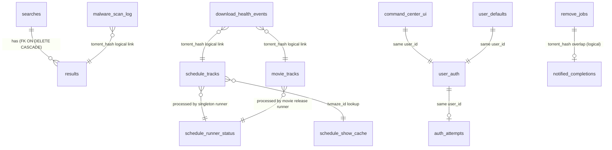

---
tags:
  - system/database
aliases:
  - DB Schema
created: 2026-04-11
updated: 2026-04-11
---

# SQLite Tables

## Overview

SQLite (a lightweight database — think of it as a single-file spreadsheet that the bot reads and writes) is where Patchy Bot keeps everything that must survive a restart. Inside that file are 14 tables. A table is one sheet in the spreadsheet: it has named columns at the top and rows of data underneath. Patchy's database file lives at `telegram-qbt/patchy_bot.db` and is locked down to owner-only permissions (`0o600`).

Here is what each of the 14 tables remembers, in plain English:

1. **`searches`** — Every time someone asks the bot to find a movie or TV show, Patchy writes down who asked, when, and what they typed. Each search gets its own short ID so the results below can point back to it.
2. **`results`** — The actual list of torrents (download recipe files) that came back from a search. One row per torrent, all linked to the parent `searches` row by ID.
3. **`user_defaults`** — Per-user settings like "always require at least 30 seeders" or "show me 20 results at a time." If a user never sets these, the bot uses values from the config file.
4. **`user_auth`** — Who is currently logged in. Patchy is password-locked, so this row says "user X is unlocked until timestamp Y."
5. **`auth_attempts`** — A failed-password counter. If someone types the wrong password too many times in a row, this table locks them out for a while so they can't keep guessing.
6. **`schedule_tracks`** — TV show tracking. One row per show+season that the user wants the bot to watch over time and auto-download new episodes for. Holds the show metadata, the list of episodes still pending, and when to next check for new airings.
7. **`schedule_runner_status`** — A single-row health log for the background scheduler (TV runner). Records when it last ran, whether the run succeeded, how many tracks were due, and any error.
8. **`schedule_show_cache`** — A cache of TVMaze show data. Hitting TVMaze every minute would be rude and slow, so the bot caches the answer for up to 8 hours per show.
9. **`remove_jobs`** — When the user asks to delete a movie or season, the deletion happens in a few stages (delete the file, refresh Plex, verify it's gone). This table tracks each removal job through those stages so the bot can retry if anything fails.
10. **`notified_completions`** — Dedup memory: which torrent hashes have already had a "download finished!" notification sent. Without this, the user could get the same notification more than once if the poller sees the same finished torrent twice.
11. **`download_health_events`** — A log of unusual things that happen during downloads (stalls, tracker errors, slow speeds, malware blocks). Used by the `/health` command and for debugging.
12. **`movie_tracks`** — Movie release tracking, the movie equivalent of `schedule_tracks`. One row per movie the user is waiting on. Holds release dates from TMDB, current status (pending → searching → downloading → done), and a "pending torrent" snapshot for when the bot has picked a candidate but is still waiting for the hash to come back.
13. **`command_center_ui`** — Each user's pinned command center message. Just stores the chat ID and message ID so the bot can keep editing the same message instead of spamming new ones.
14. **`malware_scan_log`** — A history of every torrent that was blocked by the malware scanner, when, and why.

> [!code]- Claude Code Reference
>
> All tables are created in `Store._run_schema()` (`telegram-qbt/patchy_bot/store.py:53`). The connection is opened with:
>
> ```python
> conn = sqlite3.connect(self.path, check_same_thread=False, timeout=5.0)
> conn.row_factory = sqlite3.Row
> conn.execute("PRAGMA journal_mode=WAL;")
> conn.execute("PRAGMA busy_timeout=5000;")
> conn.execute("PRAGMA foreign_keys=ON;")
> ```
>
> Plus `PRAGMA wal_autocheckpoint=1000;` inside the schema script. File mode is forced to `0o600` after creation. All writes go through a single `threading.Lock()`.
>
> ### CREATE TABLE statements (verbatim from `store.py`)
>
> ```sql
> CREATE TABLE IF NOT EXISTS searches (
>     search_id TEXT PRIMARY KEY,
>     user_id INTEGER NOT NULL,
>     created_at INTEGER NOT NULL,
>     query TEXT NOT NULL,
>     options_json TEXT NOT NULL
> );
>
> CREATE TABLE IF NOT EXISTS results (
>     search_id TEXT NOT NULL,
>     idx INTEGER NOT NULL,
>     name TEXT NOT NULL,
>     size INTEGER NOT NULL,
>     seeds INTEGER NOT NULL,
>     leechers INTEGER NOT NULL,
>     site TEXT,
>     url TEXT,
>     file_url TEXT,
>     descr_link TEXT,
>     hash TEXT,
>     uploader TEXT,
>     PRIMARY KEY (search_id, idx),
>     FOREIGN KEY (search_id) REFERENCES searches(search_id) ON DELETE CASCADE
> );
> -- migration: ALTER TABLE results ADD COLUMN quality_score INTEGER DEFAULT 0
> -- migration: ALTER TABLE results ADD COLUMN quality_json TEXT
>
> CREATE TABLE IF NOT EXISTS user_defaults (
>     user_id INTEGER PRIMARY KEY,
>     default_min_seeds INTEGER,
>     default_sort TEXT,
>     default_order TEXT,
>     default_limit INTEGER
> );
>
> CREATE TABLE IF NOT EXISTS user_auth (
>     user_id INTEGER PRIMARY KEY,
>     unlocked_until INTEGER NOT NULL,
>     updated_at INTEGER NOT NULL
> );
>
> CREATE TABLE IF NOT EXISTS auth_attempts (
>     user_id INTEGER PRIMARY KEY,
>     fail_count INTEGER NOT NULL DEFAULT 0,
>     first_fail_at INTEGER NOT NULL,
>     locked_until INTEGER NOT NULL DEFAULT 0
> );
>
> CREATE TABLE IF NOT EXISTS schedule_tracks (
>     track_id TEXT PRIMARY KEY,
>     user_id INTEGER NOT NULL,
>     chat_id INTEGER NOT NULL,
>     created_at INTEGER NOT NULL,
>     updated_at INTEGER NOT NULL,
>     enabled INTEGER NOT NULL DEFAULT 1,
>     show_name TEXT NOT NULL,
>     year INTEGER,
>     season INTEGER NOT NULL,
>     tvmaze_id INTEGER NOT NULL,
>     tmdb_id INTEGER,
>     imdb_id TEXT,
>     show_json TEXT NOT NULL,
>     pending_json TEXT NOT NULL DEFAULT '[]',
>     auto_state_json TEXT NOT NULL DEFAULT '{}',
>     skipped_signature TEXT,
>     last_missing_signature TEXT,
>     last_probe_json TEXT NOT NULL DEFAULT '{}',
>     last_probe_at INTEGER,
>     next_check_at INTEGER NOT NULL,
>     next_air_ts INTEGER,
>     UNIQUE(user_id, tvmaze_id, season)
> );
> CREATE INDEX IF NOT EXISTS idx_schedule_due ON schedule_tracks(enabled, next_check_at);
> CREATE INDEX IF NOT EXISTS idx_schedule_user_enabled ON schedule_tracks(user_id, enabled, updated_at DESC);
>
> CREATE TABLE IF NOT EXISTS schedule_runner_status (
>     status_id INTEGER PRIMARY KEY CHECK (status_id = 1),
>     created_at INTEGER NOT NULL,
>     updated_at INTEGER NOT NULL,
>     last_started_at INTEGER,
>     last_finished_at INTEGER,
>     last_success_at INTEGER,
>     last_error_at INTEGER,
>     last_error_text TEXT,
>     last_due_count INTEGER NOT NULL DEFAULT 0,
>     last_processed_count INTEGER NOT NULL DEFAULT 0,
>     metadata_source_health_json TEXT NOT NULL DEFAULT '{}',
>     inventory_source_health_json TEXT NOT NULL DEFAULT '{}'
> );
>
> CREATE TABLE IF NOT EXISTS schedule_show_cache (
>     tvmaze_id INTEGER PRIMARY KEY,
>     bundle_json TEXT NOT NULL,
>     fetched_at INTEGER NOT NULL,
>     expires_at INTEGER NOT NULL,
>     last_error_at INTEGER,
>     last_error_text TEXT,
>     updated_at INTEGER NOT NULL
> );
>
> CREATE TABLE IF NOT EXISTS remove_jobs (
>     job_id TEXT PRIMARY KEY,
>     created_at INTEGER NOT NULL,
>     updated_at INTEGER NOT NULL,
>     user_id INTEGER NOT NULL,
>     chat_id INTEGER NOT NULL,
>     item_name TEXT NOT NULL,
>     root_key TEXT NOT NULL,
>     root_label TEXT NOT NULL,
>     remove_kind TEXT NOT NULL,
>     target_path TEXT NOT NULL,
>     root_path TEXT NOT NULL,
>     scan_path TEXT,
>     plex_section_key TEXT,
>     plex_rating_key TEXT,
>     plex_title TEXT,
>     verification_json TEXT NOT NULL DEFAULT '{}',
>     disk_deleted_at INTEGER,
>     plex_cleanup_started_at INTEGER,
>     verified_at INTEGER,
>     next_retry_at INTEGER,
>     retry_count INTEGER NOT NULL DEFAULT 0,
>     status TEXT NOT NULL,
>     last_error_text TEXT
> );
> CREATE INDEX IF NOT EXISTS idx_remove_jobs_due ON remove_jobs(status, next_retry_at);
>
> CREATE TABLE IF NOT EXISTS notified_completions (
>     torrent_hash TEXT PRIMARY KEY,
>     name TEXT NOT NULL,
>     notified_at INTEGER NOT NULL
> );
> -- migration: ALTER TABLE notified_completions ADD COLUMN user_id INTEGER NOT NULL DEFAULT 0
>
> CREATE TABLE IF NOT EXISTS download_health_events (
>     event_id INTEGER PRIMARY KEY AUTOINCREMENT,
>     created_at REAL NOT NULL,
>     user_id INTEGER NOT NULL,
>     torrent_hash TEXT,
>     event_type TEXT NOT NULL,
>     severity TEXT NOT NULL,
>     detail_json TEXT NOT NULL,
>     torrent_name TEXT
> );
> CREATE INDEX IF NOT EXISTS idx_health_events_user ON download_health_events(user_id, created_at DESC);
> CREATE INDEX IF NOT EXISTS idx_health_events_type ON download_health_events(event_type, created_at DESC);
>
> CREATE TABLE IF NOT EXISTS movie_tracks (
>     track_id     TEXT PRIMARY KEY,
>     user_id      INTEGER NOT NULL,
>     tmdb_id      INTEGER,                    -- relaxed to nullable for title-only tracks
>     title        TEXT NOT NULL,
>     year         INTEGER,
>     release_date_type TEXT NOT NULL,
>     release_date_ts   INTEGER NOT NULL,
>     search_query TEXT NOT NULL,
>     status       TEXT NOT NULL DEFAULT 'pending',
>     torrent_hash TEXT,
>     last_checked_ts INTEGER,
>     next_check_ts   INTEGER,
>     error_text   TEXT,
>     notified     INTEGER NOT NULL DEFAULT 0,
>     enabled      INTEGER NOT NULL DEFAULT 1,
>     home_date_is_inferred INTEGER NOT NULL DEFAULT 1,
>     created_ts   INTEGER NOT NULL,
>     theatrical_ts INTEGER,
>     digital_ts INTEGER,
>     physical_ts INTEGER,
>     home_release_ts INTEGER,
>     digital_estimated INTEGER DEFAULT 0,
>     release_status TEXT DEFAULT 'unknown',
>     last_release_check_ts INTEGER,
>     plex_check_failures INTEGER NOT NULL DEFAULT 0,
>     pending_torrent_hash TEXT,
>     pending_torrent_name TEXT,
>     pending_torrent_size INTEGER,
>     pending_torrent_seeds INTEGER,
>     poster_url TEXT
> );
> CREATE INDEX IF NOT EXISTS idx_movie_tracks_user ON movie_tracks(user_id, status);
> CREATE INDEX IF NOT EXISTS idx_movie_tracks_pending ON movie_tracks(status, release_date_ts, next_check_ts);
> CREATE UNIQUE INDEX IF NOT EXISTS idx_movie_tracks_user_tmdb
>   ON movie_tracks(user_id, tmdb_id) WHERE tmdb_id IS NOT NULL;
>
> CREATE TABLE IF NOT EXISTS command_center_ui (
>     user_id INTEGER PRIMARY KEY,
>     chat_id INTEGER NOT NULL,
>     message_id INTEGER NOT NULL,
>     updated_at INTEGER NOT NULL
> );
>
> CREATE TABLE IF NOT EXISTS malware_scan_log (
>     id           INTEGER PRIMARY KEY AUTOINCREMENT,
>     torrent_hash TEXT NOT NULL,
>     torrent_name TEXT NOT NULL,
>     stage        TEXT NOT NULL CHECK(stage IN ('search', 'download')),
>     reasons      TEXT NOT NULL,
>     blocked_at   INTEGER NOT NULL
> );
> CREATE INDEX IF NOT EXISTS idx_malware_hash ON malware_scan_log(torrent_hash);
> CREATE INDEX IF NOT EXISTS idx_malware_blocked_at ON malware_scan_log(blocked_at);
> ```
>
> ### CRUD methods grouped by table
>
> **searches / results**
> - `save_search(user_id, query, options, rows, *, media_type='movie') -> str`
> - `get_search(user_id, search_id) -> (meta, rows) | None`
> - `get_result(user_id, search_id, idx) -> dict | None`
> - `cleanup(max_age_hours=24)`
>
> **user_defaults**
> - `get_defaults(user_id, cfg) -> dict`
> - `set_defaults(user_id, cfg, **kwargs)`
>
> **user_auth / auth_attempts**
> - `is_unlocked(user_id) -> bool`
> - `unlock_user(user_id, ttl_s) -> int`
> - `lock_user(user_id)`
> - `is_auth_locked(user_id) -> bool`
> - `record_auth_failure(user_id, ...)`
> - `clear_auth_failures(user_id)`
>
> **schedule_tracks**
> - `create_schedule_track(...)`
> - `get_schedule_track(user_id, track_id)` / `get_schedule_track_any(track_id)`
> - `list_due_schedule_tracks(due_ts, limit=10)`
> - `list_schedule_tracks(user_id, enabled_only=True, limit=20)`
> - `list_all_schedule_tracks(enabled_only=True)`
> - `count_due_schedule_tracks(due_ts) -> int`
> - `update_schedule_track(track_id, **fields)`
> - `delete_schedule_track(track_id, user_id) -> bool`
>
> **schedule_runner_status**
> - `get_schedule_runner_status() -> dict`
> - `update_schedule_runner_status(**fields)`
>
> **schedule_show_cache**
> - `get_schedule_show_cache(tvmaze_id) -> dict | None`
> - `upsert_schedule_show_cache(...)`
>
> **remove_jobs**
> - `create_remove_job(...)`
> - `get_remove_job(job_id) -> dict | None`
> - `list_due_remove_jobs(due_ts, limit=10)`
> - `update_remove_job(job_id, **fields)`
>
> **notified_completions**
> - `is_completion_notified(torrent_hash) -> bool`
> - `mark_completion_notified(torrent_hash, name, user_id=0)`
> - `get_completion_user_id(torrent_hash) -> int`
> - `cleanup_old_completion_records(max_age_hours=168)`
>
> **download_health_events**
> - `log_health_event(...)`
> - `get_health_events(...)`
> - `cleanup_old_health_events(retention_days=30) -> int`
>
> **movie_tracks**
> - `create_movie_track(...)`
> - `get_movie_track(track_id)` / `get_movie_tracks_for_user(user_id)`
> - `get_pending_movie_tracks()` / `get_downloading_movie_tracks()`
> - `update_movie_track_status(...)`
> - `increment_movie_plex_failures(track_id) -> int` / `reset_movie_plex_failures(track_id)`
> - `delete_movie_track(track_id)`
> - `movie_track_exists_for_tmdb(user_id, tmdb_id) -> bool`
> - `movie_track_exists_for_title(user_id, title) -> bool`
> - `update_movie_release_dates(...)`
> - `update_movie_track_next_check(track_id, next_check_ts)`
> - `get_movies_due_release_check(now_value, interval_s)`
> - `set_movie_track_pending_torrent(...)` / `clear_movie_track_pending_torrent(track_id)`
> - `get_title_only_tracks()`
>
> **command_center_ui**
> - `get_command_center(user_id) -> dict | None`
> - `save_command_center(user_id, chat_id, message_id)`
>
> **malware_scan_log**
> - `log_malware_block(...)`
>
> **Misc / cross-table**
> - `db_diagnostics() -> dict`
> - `backup(backup_dir) -> str`
> - `cleanup(max_age_hours=24)` (purges old searches/results)
> - `close()`



Note: SQLite enforces only the explicit FK on `results.search_id → searches.search_id`. The other relationships above are logical (joined by id or hash in code), not declared foreign keys.
