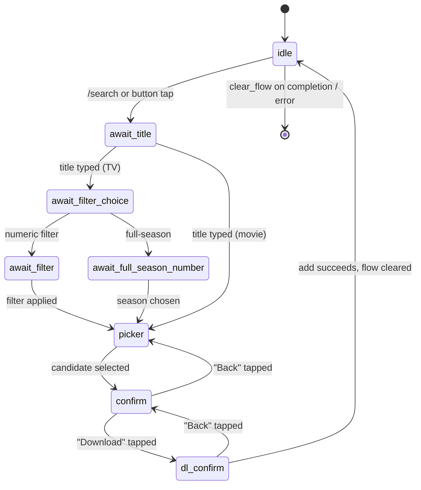
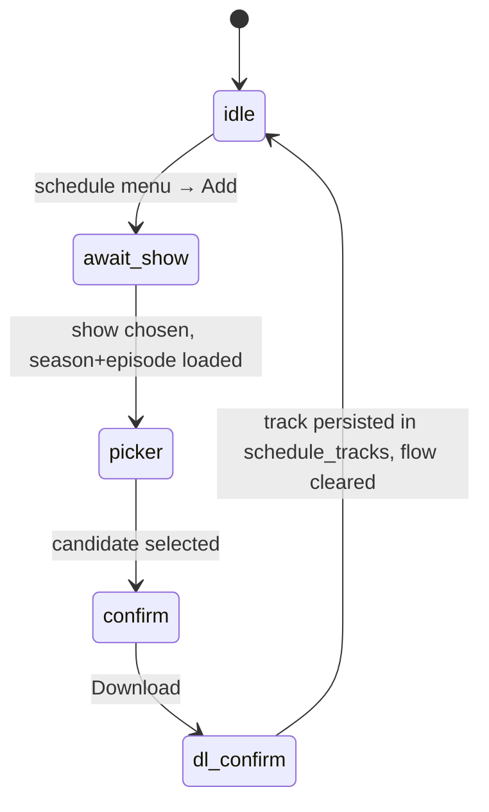
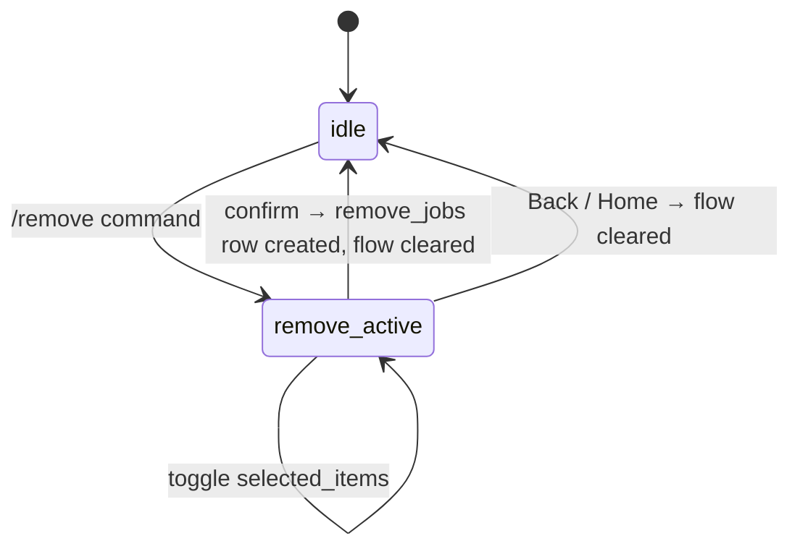

---
tags:
  - system/state
aliases:
  - User Flow State
created: 2026-04-11
updated: 2026-04-11
---

# State & Flows

## Overview

Patchy Bot is a chat bot, but most of what the user does is more like filling out a form than sending one message. They tap "Search," then they pick "TV," then they type a title, then they pick a season, then they pick an episode, then they confirm a torrent.

The bot has to remember which page of that form each user is currently on — otherwise the next button tap would have no meaning.

Think of it like a choose-your-own-adventure book. Each user is reading their own copy and is currently on a specific page. When they tap a button, the bot looks up "what page is this user on?" and then runs the right paragraph of the story.

When they finish, the bot closes the book for them.

Patchy stores this "current page" information per user as a small Python dictionary called a **flow**. Each flow has:

- A `mode` (which adventure you're in — `tv`, `movie`, `schedule`, `remove`)
- A `stage` (which page of that adventure — `await_title`, `picker`, `confirm`, `dl_confirm`, etc.)
- Extra fields holding things like the search query, the chosen season, or the list of items the user is selecting.

Flows live **in memory only**, in `HandlerContext.user_flow`, a Python dict keyed by `user_id`. Nothing about the active flow is written to SQLite — if the bot restarts mid-flow, the user just starts over.

Things that *must* survive restarts (active downloads, scheduled tracks, removal jobs) live in the database instead. This split is intentional: chat UI state is cheap to recreate, but a download in progress is not.

The three helper functions in `ui/flow.py` are the only API for this:

- `set_flow(ctx, user_id, payload)` — start or replace a flow.
- `get_flow(ctx, user_id)` — read the current flow, or `None` if the user isn't in one.
- `clear_flow(ctx, user_id)` — wipe the flow when the user finishes or backs out.

`HandlerContext` is the shared briefcase that every handler is given. Besides the per-user flow dict, it carries:

- The four API clients
- The database store
- Locks for the background runners
- The in-memory download queue
- The per-user navigation state
- Several housekeeping dicts (ephemeral message tracking, batch monitor data, chat history)

It's defined as a frozen-shape `@dataclass` in `types.py`.

> [!code]- Claude Code Reference
>
> ### `ui/flow.py` (full file)
>
> ```python
> def set_flow(ctx: HandlerContext, user_id: int, payload: dict[str, Any]) -> None:
>     ctx.user_flow[user_id] = payload
>
> def get_flow(ctx: HandlerContext, user_id: int) -> dict[str, Any] | None:
>     return ctx.user_flow.get(user_id)
>
> def clear_flow(ctx: HandlerContext, user_id: int) -> None:
>     ctx.user_flow.pop(user_id, None)
> ```
>
> Note: `bot.py` also exposes `BotApp._set_flow` / `_get_flow` wrappers used by the legacy inline handlers; both ultimately read/write the same `ctx.user_flow` dict.
>
> ### Observed `mode` values (from grep across handlers)
>
> | `mode` | Owner | Where |
> |---|---|---|
> | `"tv"` | TV search/add | `handlers/commands.py` (`/search` TV path) |
> | `"movie"` | Movie search/add | `handlers/commands.py` (`/search` movie path) |
> | `"schedule"` | TV schedule add flow | `handlers/schedule.py`, `handlers/commands.py` |
> | `"remove"` | Remove menu | `handlers/remove.py` |
>
> ### Observed `stage` values
>
> | `stage` | In which `mode` | Meaning |
> |---|---|---|
> | `await_title` | tv, movie, schedule | Waiting for the user to type a show/movie name |
> | `await_filter_choice` | tv | Choosing season/episode/full-season/full-series filter |
> | `await_filter` | tv | Entering a numeric filter |
> | `await_full_season_number` | tv | Typing a season number for full-season download |
> | `await_show` | schedule | Waiting for the show name |
> | `picker` | schedule, tv | User is browsing candidate torrents |
> | `confirm` | schedule, tv | User has selected a torrent and is reviewing |
> | `dl_confirm` | schedule, tv | Final "Yes, download" gate before add |
>
> The `remove` mode tracks selection differently: it stores `selected_items` (a list of full paths the user has ticked) instead of a stage string.
>
> ### `HandlerContext` dataclass (`telegram-qbt/patchy_bot/types.py`)
>
> ```python
> @dataclass
> class HandlerContext:
>     # Clients (immutable after init)
>     cfg: Config
>     store: Store
>     qbt: QBClient
>     plex: PlexInventoryClient
>     tvmeta: TVMetadataClient
>     patchy_llm: PatchyLLMClient
>     rate_limiter: RateLimiter
>
>     # Per-user UI state
>     user_flow: dict[int, dict[str, Any]] = field(default_factory=dict)
>     user_nav_ui: dict[int, dict[str, int]] = field(default_factory=dict)
>     user_ephemeral_messages: dict[int, list[dict[str, int]]] = field(default_factory=dict)
>
>     # Background task tracking
>     progress_tasks: dict[tuple[int, str], asyncio.Task[Any]] = field(default_factory=dict)
>     pending_tracker_tasks: dict[tuple[int, str, str], asyncio.Task[Any]] = field(default_factory=dict)
>     batch_monitor_messages: dict[int, Any] = field(default_factory=dict)
>     batch_monitor_tasks: dict[int, asyncio.Task[Any]] = field(default_factory=dict)
>     batch_monitor_data: dict[tuple[int, str], dict[str, Any]] = field(default_factory=dict)
>     command_center_refresh_tasks: dict[int, asyncio.Task[Any]] = field(default_factory=dict)
>
>     # Patchy LLM chat history (LRU OrderedDict, max 50 users)
>     chat_history: collections.OrderedDict[int, list[dict[str, str]]] = field(default_factory=collections.OrderedDict)
>     chat_history_max_users: int = 50
>
>     # Schedule source health (protected by schedule_source_state_lock)
>     schedule_source_state: dict[str, dict[str, Any]] = field(default_factory=lambda: { ... })
>     schedule_source_state_lock: threading.Lock = field(default_factory=threading.Lock)
>
>     # Async runner locks
>     schedule_runner_lock: asyncio.Lock = field(default_factory=asyncio.Lock)
>     remove_runner_lock: asyncio.Lock = field(default_factory=asyncio.Lock)
>     state_lock: asyncio.Lock = field(default_factory=asyncio.Lock)
>
>     # Sequential download queue
>     download_queue: asyncio.Queue[dict[str, Any]] = field(default_factory=asyncio.Queue)
>     active_download_hash: str | None = None
>     download_queue_lock: asyncio.Lock = field(default_factory=asyncio.Lock)
>
>     # Pending scans (added but not yet resumed)
>     pending_scans: dict[str, dict[str, Any]] = field(default_factory=dict)
>
>     # Fire-and-forget background tasks
>     background_tasks: set[asyncio.Task[Any]] = field(default_factory=set)
>
>     # Telegram Application reference (set after build_application)
>     app: Any = None
>
>     # Callbacks (set after ctx creation)
>     render_command_center: Any = None
>     navigate_to_command_center: Any = None
> ```
>
> All flow state is in-memory only. Persistence lives in [[SQLite Tables]] (e.g. `schedule_tracks`, `movie_tracks`, `remove_jobs`).

### TV / movie add flow (typical happy path)



### Schedule add flow



### Remove flow


