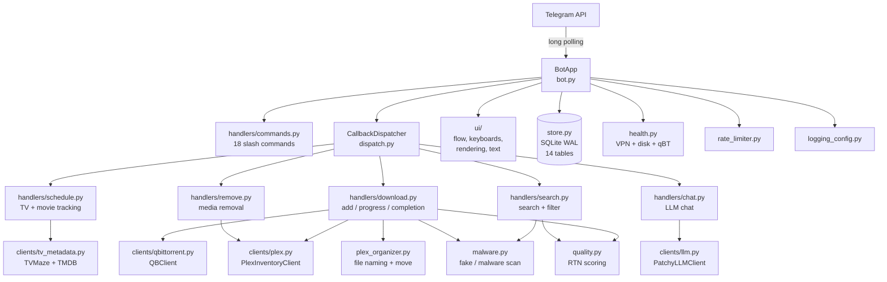

---
tags:
  - system/architecture
aliases:
  - System Overview
created: 2026-04-11
updated: 2026-04-11
---

# System Overview

## Overview

Patchy Bot is a Telegram chat bot that helps a small group of trusted users find, download, and watch movies and TV shows.

You talk to it the same way you would text a friend: you tap a button or send a message like "search for Dune", and it finds matching torrents (a torrent is a small recipe file that tells a download program where to grab pieces of a video from other people on the internet), starts downloading the best one, scans it for fakes and viruses, and then files it neatly into a Plex library so you can stream it on your TV.

Plex (a media server — think of it as your own personal Netflix that plays files stored on your computer) takes over from there.

The whole system is built like a small team of workers, each with one job:

- **Telegram interface** — the receptionist who takes your request.
- **Search worker** — hunts for torrents.
- **Download worker** — hands the chosen torrent to qBittorrent (a download program that handles the actual file transfer) and watches its progress.
- **Organizer worker** — waits for the download to finish, then renames the file and moves it into the right Plex folder.
- **Schedule worker** — runs in the background, checking every minute whether any tracked TV episodes have aired or any pre-ordered movies have been released, and kicks off downloads automatically.
- **Safety worker** — scans every torrent for malware (malicious software) and obvious fakes before letting it in.

They all share one notebook — a SQLite database (a lightweight database — think of it as a single-file spreadsheet that the bot reads and writes) — so nothing gets lost when the bot restarts.

The pieces fit together through a single message loop: Telegram sends an update, the bot parses it, looks up which worker should handle it, runs that worker, and replies. Background runners (loops that wake up on a timer) handle anything that should happen even when no one is chatting, like checking for new TV episodes.

See also:

- [[Modules]] — the file-by-file map
- [[SQLite Tables]] — the shared notebook
- [[API Clients]] — outside services it talks to
- [[State & Flows]] — how the bot remembers what each user is doing
- [[Callback Routes]] — how button taps get matched to handlers

```dataview
LIST
FROM #system
SORT file.name ASC
```



> [!code]- Claude Code Reference
> **Stack**
> - Python 3.12+
> - `python-telegram-bot` (long polling — the bot asks Telegram "anything new?" on a loop instead of receiving webhooks)
> - SQLite in WAL mode (Write-Ahead Logging — lets reads and writes happen at the same time without locking)
> - `asyncio` (Python's built-in single-threaded concurrency)
> - `requests` for synchronous HTTP to qBittorrent / Plex / TVMaze / TMDB
> - `systemd` for service management
> - Tailscale for remote/secure network access (used by Plex paths over the LAN)
>
> **Entry point**
> - Module: `telegram-qbt/patchy_bot/__main__.py` → `main()`
> - Run: `python -m patchy_bot`
> - Service: `telegram-qbt/telegram-qbt-bot.service` (systemd unit, depends on `network-online.target` and `qbittorrent.service`)
> - Restart: `sudo systemctl restart telegram-qbt-bot.service`
>
> **Top-level wiring (`__main__.py`)**
> 1. Configure logging (text or JSON via `LOG_FORMAT` env var).
> 2. `cfg = Config.from_env()` — load all settings from `.env`.
> 3. `bot = BotApp(cfg)` — constructs every client and the `HandlerContext`.
> 4. `bot._ensure_media_categories()` — retries up to 10× to confirm qBT category routing.
> 5. `bot.qbt.set_preferences(...)` — applies max-active limits, DHT/PEX/UPnP toggles. Never sets `current_network_interface` (would break libtorrent DNS through the VPN).
> 6. `bot.build_application()` then `app.run_polling(drop_pending_updates=True, allowed_updates=["message", "callback_query"])`.
>
> **Key counts (verified against code, 2026-04-11)**
> - SQLite tables: **14** (see [[SQLite Tables]])
> - Slash commands registered in `bot.py`: **18**
> - Callback dispatcher registrations: **15** (2 exact + 13 prefix — see [[Callback Routes]])
> - Background runners: 5 (schedule-runner 60 s, remove-runner 60 s, completion-poller 60 s, command-center refresh 3 s per user, qbt-health-check 300 s)
