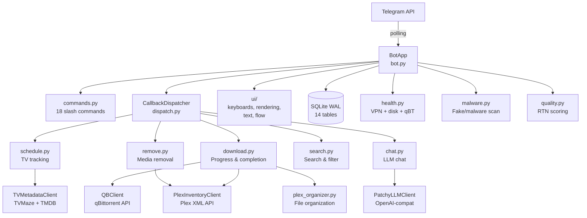

# Patchy Bot — Dashboard

> Last updated: 2026-04-11 | Python 3.12+ / python-telegram-bot / SQLite WAL / asyncio

## Current Focus

The bot is stable and running in production with 18 slash commands, 14 callback routes, and 760 tests. Recent work focused on hardening: episode filtering fixes, malware scan gating, UI flash fixes, and a batch of 17 bug fixes covering qBT firewalled auto-clear, poller dedup, hash resolver recency, EMA NoneType guards, organizer TOCTOU races, and more. The immediate priority is [[Tasks/Todos/bot-phase2-decomposition|bot.py Phase 2 decomposition]] — at 4,813 lines it's the largest file and needs further extraction of inline handler logic into the handler modules. The [[Tasks/Todos/vpn-interface-safety-docs|VPN interface safety guard]] is a medium-priority safety improvement that should be addressed before any network configuration changes.

## System Map

## Architecture

[[Architecture/modules|Modules]] | [[Architecture/tables|Tables]] | [[Architecture/callbacks|Callbacks]] | [[Architecture/clients|Clients]] | [[Architecture/state|State]]

## Status

| Category | Open | High | Medium | Low |
|----------|------|------|--------|-----|
| [[Tasks/Fixes\|Fixes]] | 0 | 0 | 0 | 0 |
| [[Tasks/Todos\|Todos]] | 2 | 0 | 2 | 0 |
| [[Tasks/Upgrades\|Upgrades]] | 2 | 0 | 0 | 2 |
| [[Ideas\|Ideas]] | 1 | 0 | 0 | 1 |

## Priority Queue

1. [[Tasks/Todos/bot-phase2-decomposition|bot.py Phase 2 decomposition]] — todo, medium — extract remaining inline handlers from 4,813-line bot.py
2. [[Tasks/Todos/vpn-interface-safety-docs|VPN interface safety guard]] — todo, medium — add runtime guard against qBT interface binding
3. [[Tasks/Upgrades/quality-dedup-cross-resolution|Quality dedup & cross-resolution]] — upgrade, low — deferred design decisions in quality.py
4. [[Tasks/Upgrades/search-early-exit-tuning|Search early-exit tuning]] — upgrade, low — benchmark and optimize search polling parameters

## Recently Completed

- 2026-04-10: Episode filtering, next-ep callback, inspection timeout, candidate cycling fixes
- 2026-04-07: Batch of 17 fixes — qBT firewalled auto-clear, poller dedup, hash resolver, EMA guards, TOCTOU race, path safety, stall reannounce, tracker error streak, pending timeout, quality trash penalty, malware scan gate, pending tracker header/keyboard, season nav arrows, HTML escape, schedule menu label, user message cleanup
- 2026-04-08: Movie release scheduling system
- 2026-04-06: Malware scan gate for download pipeline
- 2026-04-04: UI flash fix for command center refresh

## Quick Links

[[Preferences]] | [[Changelog/2026-04-completed|April 2026 Changelog]]
